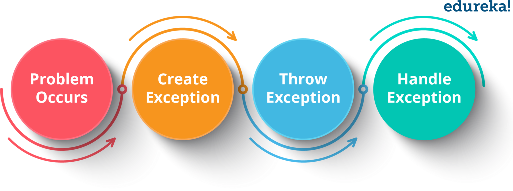
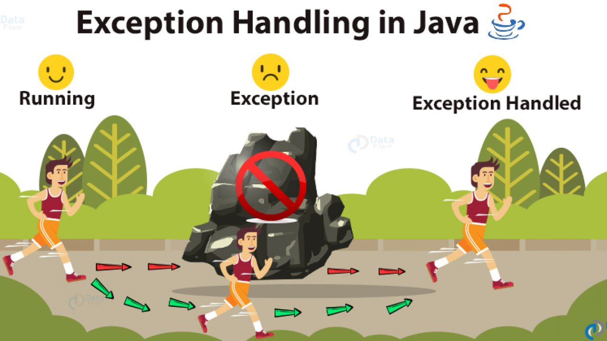
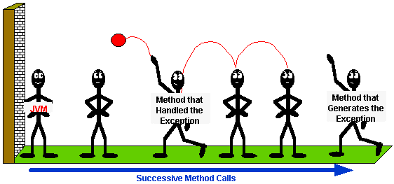
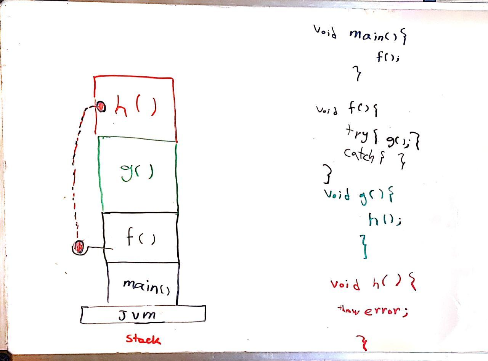

# session 8

## review exception handling 











+ what if program doesn't go well?
+ int f(int a,int b){ return a/b; }
+ index out of bound 
+ what should we return? what should we do?
+ **let the caller manage it**
+ C: return null, set global error variables, terminate =)
-----
+ high level langauges: exception handling framework
+ throw, new Exception
+ pop from stack method by method!
+ we don't catch yet
-----
+ catch -> manage thrown exceptions
+ try, catch
+ print stack trace: please don't :)
+ ignore: please don't
----
+ finally
+ try finally
+ try catch finally 
+ return in finally
-------
+ checked exception vs unchecked exception 
+ throws keyword 
+ exception hierarchy
+ Throwable

-------
+ design exception class 
+ constructors


## generic 
+ method or class that can act on different types
```java
String f(String value){
    return value;
}
Integer f(Integer value){
    return value+1;
}
Student f(Student value){
    return value;
}
```

+ same as poly-morphism! 
+ can't use specific behavior of type, because it's unknown 
+ type parameter `<V>`
+ generic method
+ why not use Object? (java 1-4)
```java
    public <V> static V f(V value){
        return value;
    }
```

+ now we use wrapper classes!

+ generic class
+ erasure, Object, cast

## collections 
+ we want to store objects 
+ arrays are not enough: add, remove, dynamic size
+ lists are better, same as linked list in ITP
+ get, set method
+ arrayList vs linkedList 
+ List is interface, implement it with arrayList and LinkedList
+ set, map: interface 
+ use set with iterator or `contains`
+ use map with `get(key)`
+ different implementations: hashSet, hashMap, treeSet, ..
+ iterator, iterable (interface), for-each


